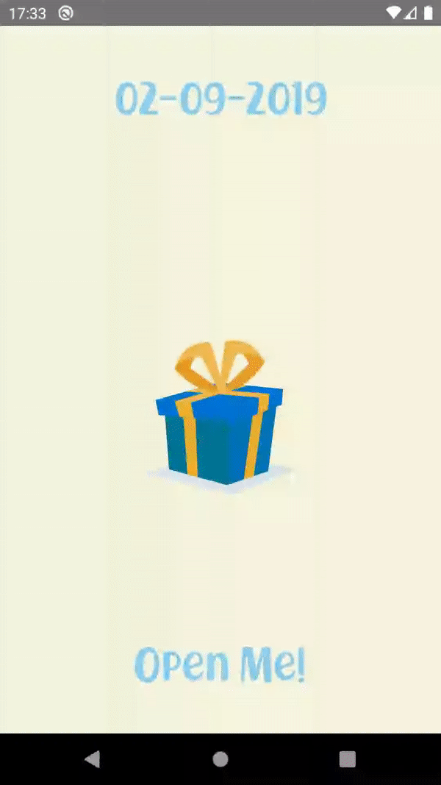

# MyLittleBunnie
This app was made for friends when they had their first child. 
When we (me and my girlfriend) heard that our good friends where expecting their first child the idea was also quickly born for a surprise app.
The idea was that we would give them a surprise package with different present for them and their child. The pakkage included 8 presents, one present for the first 8 days after the child was born.
But we also wanted to leave a personal messages or description for every present and a video message would be perfect for it. So we started thinking about ways to include the video message in the package and that how the idea of this app was born.

## What does MyLittleBunnie do?
Its already a bit described in the description above. The purpose of the app is delivering a video message for 8 days from a certain date. It will display the 8 days and if 
its that day or past that day its possible to open the message. When the date is still in the future its not possible to open the present yet.

The actual video's are removed from the app and replaced with a placeholder, to respect privacy.

## Tech stuff i wanted to try
 * Lottie\
 I wanted to try out Lottie to include some nice animation. I found the animations on [lottiefiles](https://lottiefiles.com/) and are used for the unwrapping of presents.
 * Exoplayer\
 Never did anything with playing a video. So had to use a player. The video files are included in the project itself since i would install the app myself. The apk was around 60mb with 8 videos included which wasn't to bad.
 * Koin\
I was used to DI in the form of dagger but wanted to try out something else. However the project was actually to small to really try it out.

I still used JodaTime. This is something i should have replaced with the java-time.

## Example:

